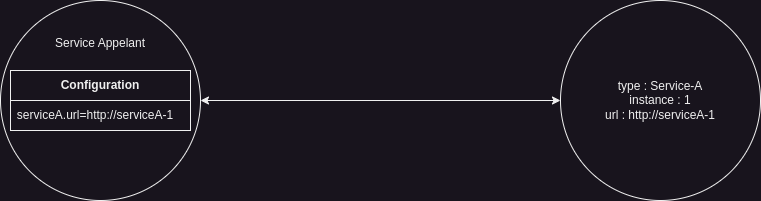
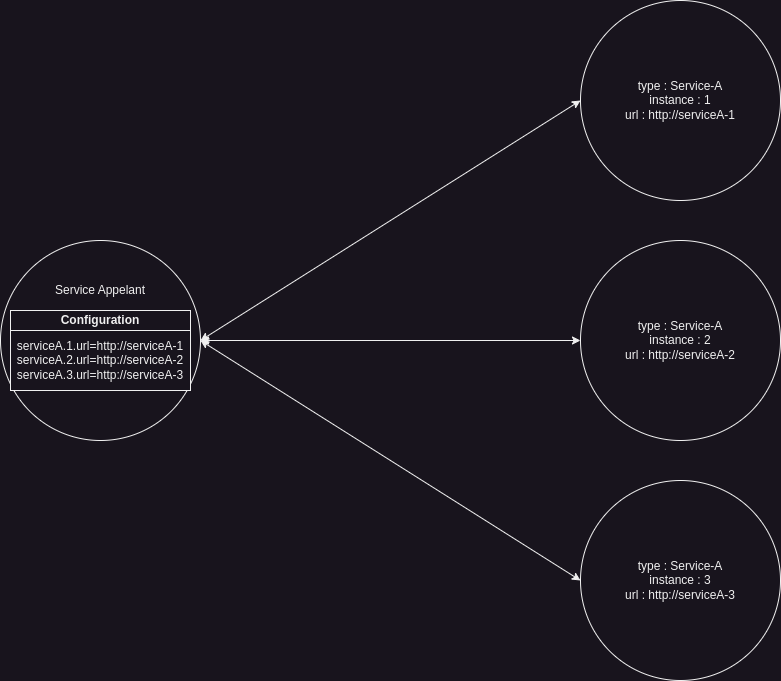
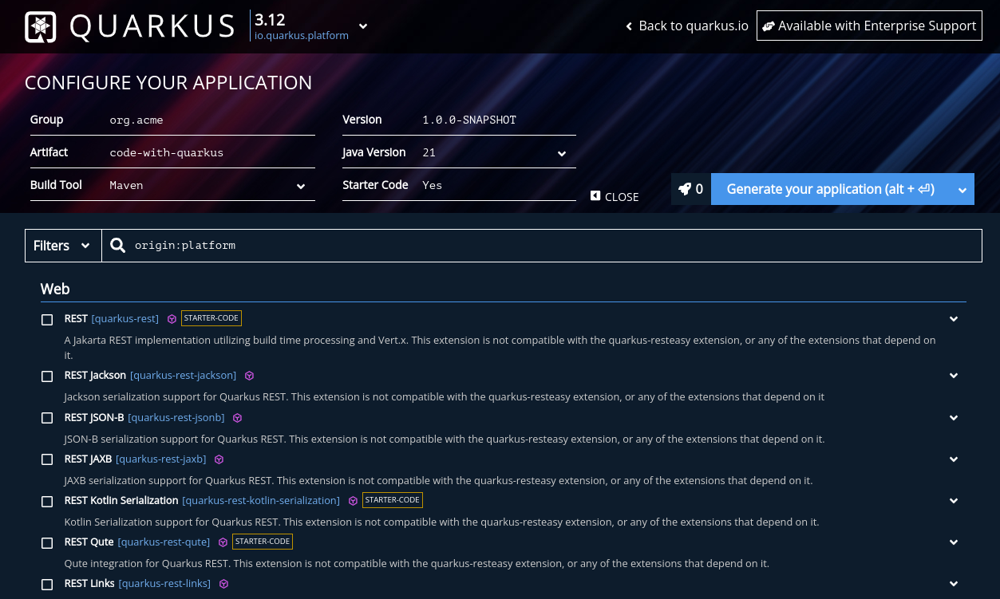

# Implémenter un Service Discovery avec [Quarkus](https://quarkus.io), [Stork](https://smallrye.io/smallrye-stork/) et [Consul](https://www.consul.io/).

## Préambule

Dans l'éco système informatique, nos différents services ont vocation à communiquer entre eux.\
Pour permettre cette communication, différentes stratégies peuvent être mises en place,
nous pouvons par exemple choisir de communiquer directement avec une simple instance d'un service.



Mais, si notre instance n'est plus disponible ?


Nous pouvons, pour palier à ce risque d'indisponibilité de notre service, choisir de communiquer avec plusieurs instances d'un service en spécifiant leurs URLs "en dur" dans la configuration de notre service appelant.



Mais dans ce cas, comment faire pour choisir sur quelle instance envoyer la requête ?\
Comment s'assurer que l'instance demandée est toujours opérationnelle ?\
Comment rajouter de nouvelles instances ?


## 1. Introduction.
Dans une architecture micro-services (ou non d'ailleurs), il est important de pouvoir scaler nos applications.

Nos différents appels doivent pouvoir être répartis entre les différents services accessibles,
il est important de savoir où ils sont situés.

Dans cette optique de scaling, il n’est pas envisageable que les informations d'accès à nos services soient indiquées manuellement dans la configuration du service appelant.\
C'est contraignant, il faudrait s'assurer de la disponibilité des instances à appeler et il faudrait s'occuper de répartir les requêtes sur les différentes instances.\
C’est dans ce cadre que notre Service Discovery entre en jeu.

Nous allons, dans cet article, parler de la mise en place d’un Service Discovery.

D’abord, nous établirons ce qu’est un Service Discovery dans son ensemble, puis ce que sont Quarkus et Stork.\
Ensuite, nous aborderons les différents acteurs nécessaires à la mise en place de cette architecture.
Enfin, nous implémenterons un exemple.

## 2. Qu'est-ce qu'un Service Discovery ?
Un Service Discovery n'est pas nécessairement un applicatif en soi, mais plutôt l'ensemble des mécanismes et applicatifs
nécessaires pour :
- Déclarer les instances d'un service afin d'être découvert.
- Découvrir ces instances afin de pouvoir router les requêtes.
- Sélectionner l'instance la plus adaptée.

## 3. Qu'est-ce que [Quarkus](https://quarkus.io) ?
Quarkus est un framework Java, similaire à Spring, fortement orienté Cloud et Micro Service.\
C’est lui qui va nous permettre d’écrire simplement nos applicatifs.

Pour accélérer le démarrage des applicatifs et faciliter leurs interactions au sein d'un environnement cloud,
un ensemble de mécanismes sont mis en place par Quarkus.
Ces mécanismes sont gérés par un système d’extensions dont font partie Stork et Consul Discovery.

## 4. Qu'est-ce que [Smallrye Stork](https://smallrye.io/smallrye-stork/) ?
Stork est un framework agissant côté client qui est responsable de découvrir et d'équilibrer la charge entre les différentes
instances d'un service.

Il assure deux grandes fonctions :
- Le Service Lookup (Discovery), qui consiste à récupérer les URL des différentes instances du service appelé.
- Le Service Selection (Load Balancing), qui consiste à envoyé la requête à l'instance du service la plus à même de la traiter en fonction des paramètres définis.

## 5. [Consul](https://www.consul.io/) à la rescousse !

Nous venons de dire qu'un Service Discovery doit effectuer un ensemble d'action, en l'occurrence, il doit être capable
de permettre de déclarer nos instances à découvrir. Mais où déclarer et conserver les déclarations de ces instances ?

### Qu'est-ce que HashiCorp Consul ?
Hashicorp Consul est une solution de mise en réseau de différents services de manière sécurisée.\
Dans notre cas, le service qui nous intéresse au sein de Consul et la partie Déclaration et Découverte de services.

### Comment Consul intervient-il dans notre Service Discovery ?
Consul est un service clé de notre architecture.\
C’est lui qui est responsable de conserver les URL des différentes instances de nos services,
il est également responsable de s’assurer de leur bon fonctionnement par le biais de health check,
et, le cas échéant, de les supprimer de la liste des instances disponibles.
C’est avec lui que nos services communiqueront pour savoir qui appeler et où.

## 6. Quels sont les services nécessaires à la mise en place de notre Service Discovery ?
Afin d'implémenter notre architecture, différents acteurs sont nécessaires :

Dans un premier temps, Consul en tant qu'application.
Il est la pierre angulaire de notre Service Discovery, il se doit d'être disponible en permanence et, dans cette optique,
peut être déployé en mode distribué. (cette partie ne fait pas l'objet de cet article)

Ensuite un client Consul côté service à découvrir.
Il sera utilisé afin de s'enregistrer auprès de Consul au démarrage du service,
se désenregistrer à l'arrêt du service et, éventuellement, se réenregistrer en cas de coupure réseau. (nous y reviendrons plus tard)

Enfin Stork côté service appelant.
Il supervisera la récuperation de la liste des instances disponibles du service à appeler,
et choisira vers lequel envoyer les requêtes.

## 7. Implémentation

### Mise en place/configuration de Consul.
Pour démarrer notre Consul, nous passerons par l'image docker officielle et la démarrerons via un docker-compose.

Commençons par la configuration la plus simple, notre consul en mode dev/standalone :

```yaml
version: '3.8'

services:
  consul:
    image: hashicorp/consul:1.19
    container_name: consul
    restart: always
    network_mode: host
    command: "agent  -dev -ui -client=0.0.0.0 -bind=127.0.0.1 --https-port=8501"
```
Cette configuration permet de tester notre applicatif en mode dev local.
Les ports ouverts sont ceux utiliser par l'interface graphique.

Notre service Consul peut maintenant être démarré en lançant la commande
`docker-compose up -d consul` dans le repertoire où se situe notre fichier *docker-compose.yml* ou en lançant
la commande `docker-compose up -f /chemin/vers/docker-compose.yml -d consul` de n'importe quel répertoire.

### Création de mon premier micro-service Quarkus (celui qui sera découvert).

#### Préparation.
La première étape consiste à générer notre projet, pour ça nous allons passer par [code.quarkus.io](https://code.quarkus.io).
l'interface ressemble à ça :

La partie en haut à gauche vous permet de configurer votre application (groupId, artifactId, ...) en cliquant sur `+ more options`
vous pourrez également choisir la version de Java à utiliser (entre autre), lors de l'écriture de cet article,
la version de Quarkus proposée était la 3.11 et la version de Java utilisé par défaut la 21.

Dans la liste des extensions disponibles, nous choisirons uniquement `REST Jackson`
(notre but ici étant juste de créer un service simple exposant une api rest)

Une fois la configuration faite et l'extension sélectionnée, il suffit de cliquer sur le bouton `Generate your application`,
de télécharger le zip et de l'extraire dans le repertoire voulu.

Une fois extrait, nous allons ajouter une autre dépendance dans notre pom :

```xml
<dependency>
  <groupId>io.smallrye.reactive</groupId>
  <artifactId>smallrye-mutiny-vertx-consul-client</artifactId>
</dependency>
```

Cette dépendance va nous permettre d'interagir avec Consul pour enregistrer notre service.

Nous allons ensuite créer notre ressource, pour ça il suffit de créer un controller rest.\
il devrait ressembler à ça :
```java
package demo.service.discovery;

import jakarta.ws.rs.GET;
import jakarta.ws.rs.Path;
import jakarta.ws.rs.Produces;

import static com.zenika.quarkus.example.DiscoveryRegistration.SERVICE_ID;
import static jakarta.ws.rs.core.MediaType.TEXT_PLAIN;

@Path("/discovered")
public class DiscoveredResource {

    @GET
    @Produces(TEXT_PLAIN)
    public String get() {
        return "a GET request has been done to `discovered` node with id : " + SERVICE_ID;
    }

}
```
#### Enregistrement de mon micro-service auprès de Consul pour découverte.

Maintenant que nous avons posé les bases, il ne nous reste plus qu'à procéder à l'enregistrement de notre service.

Pour cela, nous allons créer une classe `DiscoveryRegistration`.
Il va nous falloir un ensemble d'informations indispensables :
- l'hôte et le port de Consul
- l'hôte et le port de notre Service
- un nom unique (c'est lui qui sera utilisé pour faire la corrélation entre les différentes instances)
- un id unique propre à chaque instance de l'application.

Pour le nom unique, j'ai fait le choix de me servir du nom de l'applicatif,
il est accessible via la propriété `quarkus.application.name`.

Pour l'id unique de l'application, un UUID fera l'affaire.
C'est cet id qui sera retourné lors de l'appel à `DiscoveredResource`.

Pour l'hôte et le port de notre Service, ils sont accessibles respectivement via les propriétés `quarkus.http.host`
et `quarkus.http.port`.

Enfin pour l'hôte et le port de Consul, ce sera à nous de les spécifier, pour ça il suffit d'ajouter la configuration
dans le fichier de configuration de Quarkus (application.properties ou application.yml) qui se trouve dans `src/main/resources`

Il doit ressembler à quelque chose comme ça : 
```properties
service-registrar.host=localhost
service-registrar.port=8500
```
(le port par défaut de Consul et le 8500 et il est hébergé en local)

Maintenant que nous avons ces infos, nous pouvons commencer à construire le squelette de notre classe :

```java
package demo.service.discovery;

import java.util.UUID;

import org.eclipse.microprofile.config.inject.ConfigProperty;

public class DiscoveryRegistration {

    public static final String SERVICE_ID = UUID.randomUUID().toString();
    
    DiscoveryRegistration(@ConfigProperty(name = "service-registrar.host", defaultValue = "localhost") String consulHost,
                          @ConfigProperty(name = "service-registrar.port", defaultValue = "8500") int consulPort,
                          @ConfigProperty(name = "quarkus.http.host") String applicationHost,
                          @ConfigProperty(name = "quarkus.http.port") int applicationPort,
                          @ConfigProperty(name = "quarkus.application.name") String serviceName) {
        
    }  

}
```
Il va également nous falloir notre `ConsulClient`, celui-ci n'est pas injecté directement,
il dépend de Vertx, c'est donc une instance de Vertx qui sera injectée pour pouvoir le construire.
Notre classe devrait maintenant ressembler à ça :
```java
package demo.service.discovery;

import java.util.UUID;

import jakarta.enterprise.context.ApplicationScoped;
import jakarta.inject.Inject;

import io.vertx.ext.consul.ConsulClientOptions;
import io.vertx.mutiny.core.Vertx;
import io.vertx.mutiny.ext.consul.ConsulClient;
import org.eclipse.microprofile.config.inject.ConfigProperty;

@ApplicationScoped
public class DiscoveryRegistration {

    public static final String SERVICE_ID = UUID.randomUUID().toString();
    private final ConsulClient consulClient;
    
    @Inject
    DiscoveryRegistration(@ConfigProperty(name = "service-registrar.host", defaultValue = "localhost") String consulHost,
                          @ConfigProperty(name = "service-registrar.port", defaultValue = "8500") int consulPort,
                          @ConfigProperty(name = "quarkus.http.host") String applicationHost,
                          @ConfigProperty(name = "quarkus.http.port") int applicationPort,
                          @ConfigProperty(name = "quarkus.application.name") String serviceName,
                          Vertx vertx) {
        var consulClientOptions = new ConsulClientOptions().setHost(consulHost).setPort(consulPort);
        consulClient = ConsulClient.create(vertx, consulClientOptions);
    }  

}
```
Nous pouvons maintenant définir notre service.
Notre classe va évoluer vers ça :
```java
package demo.service.discovery;

import java.util.UUID;

import jakarta.enterprise.context.ApplicationScoped;
import jakarta.inject.Inject;

import io.vertx.ext.consul.ConsulClientOptions;
import io.vertx.ext.consul.ServiceOptions;
import io.vertx.mutiny.core.Vertx;
import io.vertx.mutiny.ext.consul.ConsulClient;
import org.eclipse.microprofile.config.inject.ConfigProperty;

@ApplicationScoped
public class DiscoveryRegistration {

    public static final String SERVICE_ID = UUID.randomUUID().toString();
    private final ConsulClient consulClient;
    private final ServiceOptions serviceOptions;
    
    @Inject
    DiscoveryRegistration(@ConfigProperty(name = "service-registrar.host", defaultValue = "localhost") String consulHost,
                          @ConfigProperty(name = "service-registrar.port", defaultValue = "8500") int consulPort,
                          @ConfigProperty(name = "quarkus.http.host") String applicationHost,
                          @ConfigProperty(name = "quarkus.http.port") int applicationPort,
                          @ConfigProperty(name = "quarkus.application.name") String serviceName,
                          Vertx vertx) {
        var consulClientOptions = new ConsulClientOptions().setHost(consulHost).setPort(consulPort);
        consulClient = ConsulClient.create(vertx, consulClientOptions);
        serviceOptions = new ServiceOptions()
                .setId(SERVICE_ID)
                .setName(serviceName)
                .setAdress(applicationHost)
                .setPort(applicationPort);
    }  

}
```
Nous avons fini d'initialiser notre classe, il ne nous reste plus qu'à écrire les méthodes pour s'enregistrer
et se désenregistrer.
ConsulClient s'appuie sur [Smallrye Mutiny](https://smallrye.io/smallrye-mutiny/) qui est une librairie pour faire
de la programmation réactive événementielle.
ConsulClient propose deux méthodes pour enregistrer un service, une "bloquante"
`registerServiceAndAwait(ServiceOptions serviceOptions)` et une "non bloquante"
`registerService(ServiceOptions serviceOptions)` qui sera exécuté sur un thread dedié.

Ici, nous utiliserons la méthode non bloquante.

Voici à quoi ressemble la méthode d'enregistrement :
```java
public void register(@Observe StartupEvent event) {
    consulClient.registerService(serviceOptions).subscribe().with(unused -> System.out.printf("service with id %s registered at %s.%n", SERVICE_ID, Instant.now()));
}
```
La méthode `registerService` est non bloquante, mais elle est également lazy, elle ne sera *jamais* exécutée si personne 
n'y souscrit. Le `.subscribe()` et la manière d'y souscrire (ici avec un `Consumer<Void>` matérialisé par
`.with(unused -> // do something`) sont obligatoires pour que l'enregistrement du service se fasse.

Notre classe ressemble maintenant à ça :
```java
package com.zenika.quarkus.example;

import java.time.Instant;
import java.util.UUID;

import jakarta.enterprise.context.ApplicationScoped;
import jakarta.enterprise.event.Observes;
import jakarta.inject.Inject;

import io.quarkus.runtime.ShutdownEvent;
import io.quarkus.runtime.StartupEvent;
import io.vertx.ext.consul.ConsulClientOptions;
import io.vertx.ext.consul.ServiceOptions;
import io.vertx.mutiny.core.Vertx;
import io.vertx.mutiny.ext.consul.ConsulClient;
import org.eclipse.microprofile.config.inject.ConfigProperty;

@ApplicationScoped
public class DiscoveryRegistration {

    public static final String SERVICE_ID = UUID.randomUUID().toString();
    private final ConsulClient consulClient;
    private final ServiceOptions serviceOptions;

    @Inject
    DiscoveryRegistration(@ConfigProperty(name = "service-registrar.host", defaultValue = "localhost") String consulHost,
                          @ConfigProperty(name = "service-registrar.port", defaultValue = "8500") int consulPort,
                          @ConfigProperty(name = "quarkus.http.host") String applicationHost,
                          @ConfigProperty(name = "quarkus.http.port") int applicationPort,
                          @ConfigProperty(name = "quarkus.application.name") String serviceName,
                          Vertx vertx) {
        var consulClientOptions = new ConsulClientOptions().setHost(consulHost).setPort(consulPort);
        consulClient = ConsulClient.create(vertx, consulClientOptions);
        serviceOptions = new ServiceOptions()
                .setId(SERVICE_ID)
                .setName(serviceName)
                .setAddress(applicationHost)
                .setPort(applicationPort);
    }

    public void register(@Observes StartupEvent event) {
        consulClient.registerService(serviceOptions).subscribe().with(unused -> System.out.printf("service with id %s registered at %s.%n", SERVICE_ID, Instant.now()));
    }

}
```

#### Déconnexion gracieuse.

Maintenant que l'enregistrement auprès de Consul s'est effectué correctement, nous allons nous pencher sur la déconnexion.\
Tout comme pour l'enregistrement, ConsulClient propose deux méthodes pour désenregistrer son service,
`deregisterService(String serviceId)` et `deregisterServiceAndAwait(String serviceId)`.\
Ici non utiliseront la méthode bloquante.

Notre méthode de désenregistrement ressemble à ça :
```java
public void deregister(@Observe ShutdownEvent event) {
    consulClient.deregisterServiceAndAwait(SERVICE_ID);
}
```
Une fois tous les éléments regroupés voici notre classe :

```java
package com.zenika.quarkus.example;

import java.time.Instant;
import java.util.UUID;

import jakarta.enterprise.context.ApplicationScoped;
import jakarta.enterprise.event.Observes;
import jakarta.inject.Inject;

import io.quarkus.runtime.ShutdownEvent;
import io.quarkus.runtime.StartupEvent;
import io.vertx.ext.consul.ConsulClientOptions;
import io.vertx.ext.consul.ServiceOptions;
import io.vertx.mutiny.core.Vertx;
import io.vertx.mutiny.ext.consul.ConsulClient;
import org.eclipse.microprofile.config.inject.ConfigProperty;

@ApplicationScoped
public class DiscoveryRegistration {

    public static final String SERVICE_ID = UUID.randomUUID().toString();
    private final ConsulClient consulClient;
    private final ServiceOptions serviceOptions;

    @Inject
    DiscoveryRegistration(@ConfigProperty(name = "service-registrar.host", defaultValue = "localhost") String consulHost,
                          @ConfigProperty(name = "service-registrar.port", defaultValue = "8500") int consulPort,
                          @ConfigProperty(name = "quarkus.http.host") String applicationHost,
                          @ConfigProperty(name = "quarkus.http.port") int applicationPort,
                          @ConfigProperty(name = "quarkus.application.name") String serviceName,
                          Vertx vertx) {
        var consulClientOptions = new ConsulClientOptions().setHost(consulHost).setPort(consulPort);
        consulClient = ConsulClient.create(vertx, consulClientOptions);
        serviceOptions = new ServiceOptions()
                .setId(SERVICE_ID)
                .setName(serviceName)
                .setAddress(applicationHost)
                .setPort(applicationPort);
    }

    public void register(@Observes StartupEvent event) {
        consulClient.registerService(serviceOptions).subscribe().with(unused -> System.out.printf("service with id %s registered at %s.%n", SERVICE_ID, Instant.now()));
    }

    public void deregister(@Observe ShutdownEvent event) {
        consulClient.deregisterServiceAndAwait(SERVICE_ID);
    }
    
}
```

Maintenant que tout est prêt, si nous démarrons notre applicatif (via la commande `mvn quarkus:dev` par exemple) et que
nous accédons à l'interface de Consul, nous pouvons voir notre service apparaitre.

En lançant plusieurs instances, elles apparaissent dans Consul.

Et en cliquant sur le service, nous pouvons voir des informations supplémentaires, telles que l'URL, le nom de la machine, l'état des health check.


Nous en avons fini pour l'instant avec notre Service à découvrir, passons à notre deuxième service.

### Création de mon deuxième micro-service Quarkus.

#### Préparation

Pour ce micro-service, nous allons nous servir du plugin Quarkus d'IntelliJ, les plugins des autres éditeurs sont similaires.

Pour IntelliJ, nous y accédons en passant par `File -> New -> Project...`.
Dans la liste de gauche nous choisirons `Quarkus` qui se situe dans `Generator`.


Une fois la configuration faite, nous pouvons passer à l'étape suivante.\
Ici, nous choisirons les extensions `Rest Jackson`, `Rest Client Jackson` et `Smallrye Stork`, les trois se situent dans
le sous-menu `Web`.


Puis, nous pouvons valider la création du projet.

Nous devons ensuite ajouter la dépendance suivante :

```xml
<dependency>
  <groupId>io.smallrye.stork</groupId>
  <artifactId>stork-service-discovery-consul</artifactId>
</dependency>
```
Elle va nous permettre de preciser quel type de discovery provider Stork doit utiliser (ici Consul).

La structure de base de notre projet est prête, nous allons donc, comme pour notre autre service, créer notre ressource.

```java
package demo.service.discovery;

import jakarta.ws.rs.GET;
import jakarta.ws.rs.Path;
import jakarta.ws.rs.Produces;

import static com.zenika.quarkus.example.DiscoveryRegistration.SERVICE_ID;
import static jakarta.ws.rs.core.MediaType.TEXT_PLAIN;

@Path("/discoverer")
public class DiscovererResource {

    @GET
    @Produces(TEXT_PLAIN)
    public String get() {
        return "";
    }

}
```
Pour l'instant, elle renvoie une chaine vide.

#### Mise en place de du Client Rest

Notre but est de consommer notre premier service, il va donc nous falloir un client Rest.
En Quarkus, il est implémenté de cette façon : 
```java
package demo.service.discovery;

import jakarta.ws.rs.GET;
import jakarta.ws.rs.Path;

import org.eclipse.microprofile.rest.client.inject.RegisterRestClient;

@RegisterRestClient
public interface DiscoveredRestClient {

    @GET
    @Path("/discovered")
    String get();

}
```
C'est suffisant pour que nos appels soient effectués.\
Nous avons dit que nous voulions nous servir de Stork pour découvrir nos instances et répartir la charge,
pour cela, il suffit de rajouter une information dans l'annotation `RegisterRestClient`.\
Notre client Rest ressemble maintenant à ça :

```java
package demo.service.discovery;

import jakarta.ws.rs.GET;
import jakarta.ws.rs.Path;

import org.eclipse.microprofile.rest.client.inject.RegisterRestClient;

@RegisterRestClient(baseUri="stork://discovered")
public interface DiscoveredRestClient {

    @GET
    @Path("/discovered")
    String get();

}
```
C'est tout ce qu'il nous faut pour notre client Rest !!!\
Vous noterez à quel point c'est simple d'utiliser Stork.\
La `baseUri` de notre annotation porte deux choses :
- l'utilisation de Stork (le protocole utilisé est stork plutôt que http ou https)
- le nom du service à découvrir, tel qu'enregistré auprès de Consul.
  (Sans l'utilisation de notre service discovery, la `baseUri` aurait ressemblé à : `http(s)://{service.host}:{service.port}`)

Aucune notion d'hôte, de port ou même de sécurité n'est utilisée. Stork s'occupe de toute la tambouille interne.\
il nous faut cependant ajouter un peu de configuration dans le fichier `application.properties` afin de définir qui s'occupe de stocker nos informations et de comment y accéder :

```properties
quarkus.stork.discovered.service-discovery.type=consul
quarkus.stork.discovered.service-discovery.consul-host=localhost
quarkus.stork.discovered.service-discovery.consul-port=8500
```
#### Appel à mon premier service.

Maintenant que le client Rest et que sa configuration est en place, il ne nous reste qu'à l'utiliser.\
Il suffit de faire évoluer notre ressource (pour des raisons de simplicité, le client Rest sera accessible directement de notre Contrôleur)

Elle ressemble maintenant à ça :
```java
package demo.service.discovery;

import jakarta.ws.rs.GET;
import jakarta.ws.rs.Path;
import jakarta.ws.rs.Produces;

import static com.zenika.quarkus.example.DiscoveryRegistration.SERVICE_ID;
import static jakarta.ws.rs.core.MediaType.TEXT_PLAIN;

@Path("/discoverer")
public class DiscovererResource {
    
    private final DiscoveredRestClient discoveredRestClient;
    
    @Inject
    DiscovererResource(@RestClient DiscoveredRestClient discoveredRestClient) {
        this.discoveredRestClient = discoveredRestClient;
    }
    
    @GET
    @Produces(TEXT_PLAIN)
    public String get() {
        return discoveredRestClient.get();
    }

}
```
Et... C'est tout ! Tout est prêt pour tester que ça fonctionne comme attendu.

Pour faire nos tests, il suffit de lancer plusieurs instances de notre service `discovered`